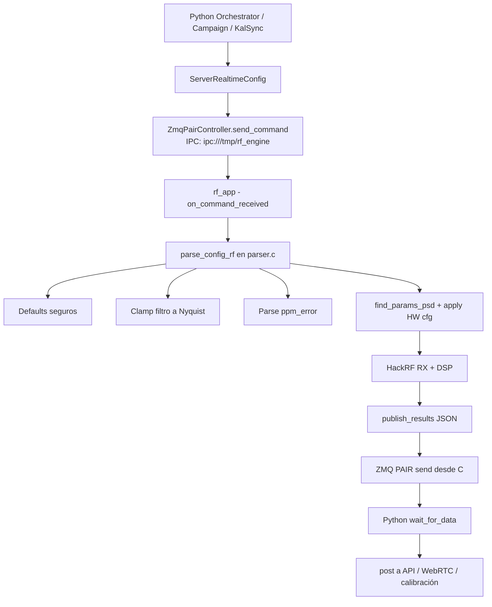

# SDR-SpectrumMonitoring-Sensor

Repositorio del **sensor SDR de monitoreo espectral** con arquitectura híbrida **C + Python**:

- **C (tiempo real):** adquisición IQ con HackRF, PSD/demodulación, GPS/LTE, GPIO, publicación por ZMQ.
- **Python (orquestación):** lógica de campañas/realtime, calibración, subida a API, cola de reintentos, estado.
- **Shared state:** `ShmStore` sobre `/dev/shm/persistent.json` para intercambio entre procesos.

---

## 1) ¿Qué encontrarás en este repo?

### Núcleo de adquisición y DSP (C)
- `rf/rf.c`: loop principal del motor RF.
- `rf/libs/parser.c`: parsea/valida config JSON y aplica defaults/clamping (incluye `ppm_error`).
- `rf/libs/zmq_util.c`: transporte ZMQ tipo `PAIR`.
- `gps-lte/gps-lte.c`: adquisición GPS + conectividad LTE + update de coordenadas en SHM.
- `common/bacn_gpio.*`: acceso GPIO (cuando no compilas en modo standalone).

### Orquestación y servicios (Python)
- `orchestrator.py`: estado global (IDLE/REALTIME/CAMPAIGN/KALIBRATING) y coordinación.
- `campaign_runner.py`: ejecución de campañas programadas.
- `retry_queue.py`: reintentos de payloads fallidos.
- `status.py`: heartbeat/estado del sensor.
- `functions.py`: scheduler, utilidades y clase `AcquireDual`.
- `utils/request_util.py`: cliente HTTP + `ZmqPairController`.
- `utils/io_util.py`: `ShmStore`, escritura atómica y timers.

### Calibración
- `kal_sync_legal_FM.py`: calibración de `ppm_error` usando frecuencias legales FM cercanas.
- `kal_sync_pilot_tone.py`: estimación alternativa por tono piloto FM y persistencia de `ppm_error`.

### Build / instalación / docs
- `build.sh`: compilación CMake (`standard` o `-dev`).
- `install.sh`: instalación completa para despliegue (servicios, permisos, SHM, reboot).
- `document.sh`: pipeline de documentación (Doxygen + Sphinx HTML).
- `build_docs.sh`: rebuild rápido de docs HTML con `doc-venv` existente.
- `docs/`: fuente Sphinx.
- `Doxyfile`: fuente Doxygen para C.

---

## 2) Compilación del proyecto

## 2.1 Compilación estándar (dispositivo objetivo)
Genera los dos binarios principales:
- `rf_app`
- `ltegps_app`

```bash
./build.sh
```

Internamente:
- Configura CMake sin flags especiales.
- Compila target `all`.
- Mueve binarios al root del repo.
- Elimina carpeta `build/` temporal.

## 2.2 Compilación para PC sin GPIO (`-dev`)
Este modo está pensado para desarrollo local (por ejemplo, laptop/desktop sin hardware GPIO):

```bash
./build.sh -dev
```

Qué hace exactamente:
- Pasa `-DBUILD_STANDALONE=ON` a CMake.
- Compila solo target `rf_app`.
- En `CMakeLists.txt` evita `gpiod` y define `NO_COMMON_LIBS`.

> Resultado: puedes compilar y trabajar el motor RF sin dependencia de GPIO real.

---

## 3) Instalación completa (modo despliegue)

`install.sh` está orientado a instalación end-to-end en el equipo objetivo:

```bash
sudo ./install.sh
```

Resumen de lo que hace:
1. Detiene servicios `*-ane2` activos (excepto LTE según regla del script).
2. Instala dependencias del sistema.
3. Compila dependencias de hardware si faltan (`libgpiod`, `kalibrate-hackrf`).
4. Crea/recrea `venv`, instala `requirements.txt`, ejecuta `build.sh`.
5. Inicializa `/dev/shm/persistent.json` con permisos compartidos.
6. Genera y habilita daemons/timers via `init_sys.py` + `daemons/*.service`.
7. Recarga systemd y **reinicia** el equipo.

---

## 4) Tutorial de autodocumentación (automatizada en `docs/`)

El repo ya incluye automatización de documentación para código C + Python.

## 4.1 Build automático completo (recomendado)

```bash
./document.sh
```

Este script:
- Crea `doc-venv` si no existe.
- Instala `docs/requirements.txt`.
- Limpia `docs/_build` y `docs/xml`.
- Ejecuta `doxygen Doxyfile` (genera XML C).
- Ejecuta Sphinx para HTML.

Salida HTML:
- `docs/_build/html/index.html`

## 4.2 Rebuild rápido de HTML
Si ya tienes `doc-venv` armado:

```bash
./build_docs.sh
```

Hace limpieza y `make html` en `docs/`.

## 4.3 Generar PDF automático
El `docs/Makefile` soporta objetivos de Sphinx; para PDF usa `latexpdf`.

```bash
source doc-venv/bin/activate
cd docs
make latexpdf
```

Salida típica:
- `docs/_build/latex/*.pdf`

Si falta toolchain LaTeX, instala (Debian/Ubuntu):

```bash
sudo apt-get update
sudo apt-get install -y texlive-latex-extra texlive-lang-spanish latexmk
```

> Tip: si quieres **HTML + PDF en una sola corrida**:
>
> ```bash
> ./document.sh && (source doc-venv/bin/activate && cd docs && make latexpdf)
> ```

---

## 5) Flujo técnico: `parser.c` + ZMQ entre Python y C

### Puntos clave
- Python arma config (`ServerRealtimeConfig`) y la manda por ZMQ (`ZmqPairController.send_command`).
- C recibe payload (`on_command_received` en `rf/rf.c`).
- `parse_config_rf` (`rf/libs/parser.c`) aplica:
  - defaults de seguridad,
  - parseo de campos,
  - clamping del filtro a banda Nyquist,
  - parseo de `ppm_error`,
  - parseo de `cooldown_request` (float en segundos, default `1.0`, comportamiento sticky).
- C ejecuta adquisición/PSD y publica resultados JSON por ZMQ (`publish_results`).
- Python consume respuesta (`wait_for_data`) y la usa en realtime/campaign/calibración.

### Diagrama de flujo (Parser + IPC)



---

## 6) Flujo de `ppm_error` (calibración)

- `kal_sync_legal_FM.py` calcula corrección y persiste en SHM:
  - `ppm_error`
  - `last_kal_ms`
- `kal_sync_pilot_tone.py` también puede persistir corrección estimada.
- `parser.c` consume `ppm_error` al parsear la config entrante.

En operación, la calibración alimenta el parámetro que utiliza el motor RF para compensación de frecuencia.

---

## 7) SHM y placeholder de referencia

Estado compartido real:
- `/dev/shm/persistent.json`

Snapshot/placeholder del esquema esperado:
- `json/shmstore.jsonc`

Campos relevantes para calibración y GPS:
- `last_lat`, `last_lng`, `changed_gps`
- `legal_freqs` (cache para evitar recargar DB ANE cada corrida)
- `ppm_error`, `last_kal_ms`

Campos relevantes para pacing RF:
- `cooldown_request` (float, segundos, `>= 0`): intervalo mínimo entre requests/procesamiento PSD en `rf_app`.
- Si no se envía, el motor usa `1.0` s por defecto; si se envía, mantiene ese valor hasta nuevo update.

---

## 8) Desarrollo local rápido (sin GPIO)

```bash
# 1) Crear entorno Python
python3 -m venv venv
source venv/bin/activate
pip install -r requirements.txt

# 2) Compilar C sin GPIO
./build.sh -dev

# 3) Ejecutar componentes Python según necesidad
python3 orchestrator.py
```

---

## 9) Notas operativas

- `install.sh` está pensado para despliegue y termina en reboot.
- En modo dev usa `build.sh -dev` para evitar dependencias de GPIO físico.
- El IPC por defecto se define en `cfg.py` (`IPC_ADDR = ipc:///tmp/rf_engine`).
- Para documentar C correctamente, asegúrate de tener `doxygen` instalado.

---

## 10) Licenciamiento / autoría

Este README describe la estructura y operación técnica actual del repositorio.
Para políticas de publicación, uso y licencias, revisar los lineamientos del proyecto/organización.
