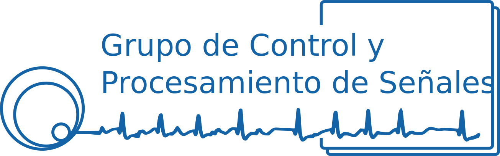

.. index.rst

==========================================================
Sensor SDR para Monitoreo del Espectro Radioeléctrico
==========================================================

Bienvenido a la documentación técnica del **Sensor de Monitoreo Espectral**. Este sistema es una solución integrada que combina hardware de radiofrecuencia de alto rendimiento con una arquitectura de software distribuida para la captura, análisis y retransmisión de señales.

.. raw:: html

   

      <strong>Objetivo del Proyecto:</strong> Proporcionar una plataforma robusta para la adquisición de datos de Potencia Espectral (PSD), geolocalización precisa vía GPS y streaming de audio WebRTC.
   

Tabla de Contenidos Principal
=============================

.. toctree::
   :maxdepth: 2
   :caption: 🛠️ Capa de Hardware (C)
   :numbered:

   c_modules

.. toctree::
   :maxdepth: 2
   :caption: 🐍 Orquestación (Python)
   :numbered:

   python_modules

Arquitectura del Sistema
========================
El sistema se divide en dos dominios principales:

1. **Dominio de Tiempo Real (C):** Controladores de bajo nivel para el HackRF One y el módulo GPS, optimizados para latencia mínima y acceso directo a registros.
2. **Dominio de Aplicación (Python):** Gestión de campañas de medición, procesamiento de señales (DSP), streaming WebRTC y sincronización con la nube.

.. tip::
   Para desarrolladores: Asegúrese de tener configurado correctamente el entorno de **Doxygen** antes de compilar esta documentación para visualizar los diagramas de llamadas de C.